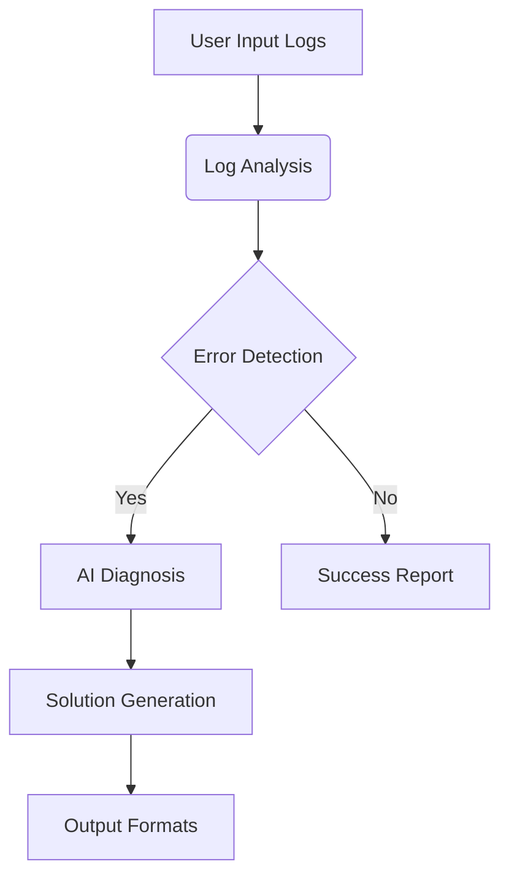

# Dynamic AI-powered Dev Prompter 

[](https://opensource.org/licenses/MIT) [](https://github.com/yourusername/dev-prompter/actions) [](https://github.com/yourusername/dev-prompter/issues)

***Tagline: build.fix.iterate***

## 📋 Table of Contents
- [Overview](#overview)
- [Features](#features)
- [Prerequisites](#prerequisites)
- [Installation](#installation)
- [Configuration](#configuration)
- [Usage](#usage)
- [Testing](#testing)
- [Deployment](#deployment)
- [Troubleshooting](#troubleshooting)
- [Contributing](#contributing)
- [License](#license)

## Overview
The Dynamic AI-powered Dev Prompter is a tool designed to help developers quickly identify and resolve issues in their build logs. It analyzes logs from various sources (GitHub, Netlify, Terminal, etc.) and provides targeted fixes and enhancements.

## Features
- **Log Analysis**: Parses build logs from multiple sources
- **AI-Powered Recommendations**: Provides targeted fixes based on the analyzed logs
- **Multiple Output Formats**: Supports markdown, CSV, and plain text outputs
- **API Integration**: Optional integration with Gemini Dev API for enhanced recommendations

## Prerequisites
- Node.js 18.x+
- npm 9.x+
- Git
- Gemini Dev API key (optional)

## Installation
1. Clone the repository:
   ```bash
   git clone https://github.com/yourusername/dev-prompter.git
   ```
2. Install dependencies:
   ```bash
   npm install
   ```
3. Start the development server:
   ```bash
   npm start
   ```

## Configuration

Create `.env` file in root directory:
```env
# Required for API integration
VITE_GEMINI_API_KEY=your_api_key_here
```

## Usage
1. Copy the build logs from GitHub, Netlify, Terminal, or any IDE.
2. Paste the logs into the textarea of the Dynamic AI-powered Dev Prompter.
3. The tool will analyze the logs and provide recommendations.
4. Copy the output as markdown, or download it as CSV, MD, or text.
5. Use the recommendations to fix the issue or share it with your team.

## API Integration
For enhanced recommendations, you can integrate with the Gemini Dev API:
1. Get your API key from https://aistudio.google.com/apikey
2. Add your API key in the API Management Settings

## Testing

Run test suite:
```bash
npm test
```

Test coverage report:
```bash
npm run test:coverage
```

## Deployment

### Production Build
```bash
npm run build
```

Deploy the `dist` directory to your preferred hosting platform (Netlify, Vercel, etc.).

## Troubleshooting

### Common Errors

**Vite Host Configuration**
```
Blocked request. Host not allowed
```
Add to `vite.config.js`:
```js
export default defineConfig({
  server: {
    allowedHosts: ['your-domain.com']
  }
})
```

**TypeScript Deep Instantiation**
```
error TS2589: Type instantiation is excessively deep
```
Simplify complex types or use type assertions for critical paths.

## Contributing
We welcome contributions! Please follow these steps:
1. Fork the repository
2. Create a new branch (`git checkout -b feature/YourFeatureName`)
3. Commit your changes (`git commit -m 'Add some feature'`)
4. Push to the branch (`git push origin feature/YourFeatureName`)
5. Open a pull request

## License
This project is licensed under the MIT License - see the [LICENSE](LICENSE) file for details.

## Workflow Diagram



## Example Output
```
For the code/log I present, I get an error.
Please think step-by-step in order to resolve it without breaking any functionality.
    ```
Blocked request. This host ("183b05a1-f757-48de-89da-fb5e0449a514.lovableproject.com") is not allowed.
To allow this host, add "183b05a1-f757-48de-89da-fb5e0449a514.lovableproject.com" to `server.allowedHosts` in vite.config.js.

src/components/DataImport.tsx(47,31): error TS2739: Type 'MetricCalculation' is missing the following properties from type '{ performance: { impressions: number; clicks: number; spend: number; ctr: number; conversionRate: number; roas: number; }; sales: { totalSales: number; totalOrders: number; }; weeklyMetrics: { period: string; ... 7 more ...; ctr: number; }[]; monthlyMetrics: { ...; }[]; detailedMetrics: { ...; }; }': performance, sales, weeklyMetrics, monthlyMetrics, detailedMetrics
src/components/metrics/KeywordHeatmap.tsx(46,9): error TS2589: Type instantiation is excessively deep and possibly infinite.
src/contexts/ImportContext.tsx(114,18): error TS2345: Argument of type '{ performance: { impressions: any; clicks: any; spend: any; ctr: number; conversionRate: number; roas: number; }; sales: { totalSales: any; totalOrders: any; }; weeklyMetrics: { period: string; impressions: any; ... 6 more ...; ctr: number; }[]; monthlyMetrics: { period: string; impressions: any; ... 6 more ...; ctr...' is not assignable to parameter of type 'SetStateAction<MetricCalculation>'.
src/lib/supabaseClient.ts(22,33): error TS2556: A spread argument must either have a tuple type or be passed to a rest parameter.
src/setupTests.ts(24,1): error TS2322: Type 'typeof IntersectionObserver' is not assignable to type '{ new (callback: IntersectionObserverCallback, options?: IntersectionObserverInit): IntersectionObserver; prototype: IntersectionObserver; }'.
  Types of property 'prototype' are incompatible.
    Type 'IntersectionObserver' is missing the following properties from type 'IntersectionObserver': root, rootMargin, thresholds, takeRecords
src/setupTests.ts(26,10): error TS2339: Property 'callback' does not exist on type 'IntersectionObserver'.
    ```
***Please think step-by-step in order to resolve it without breaking any functionality.***
```

---